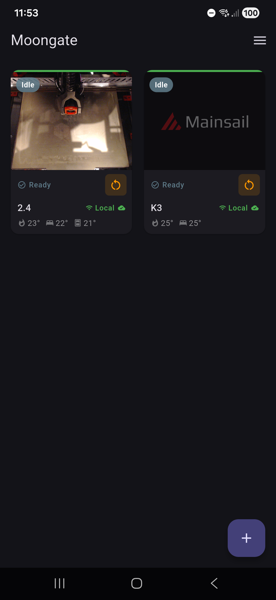
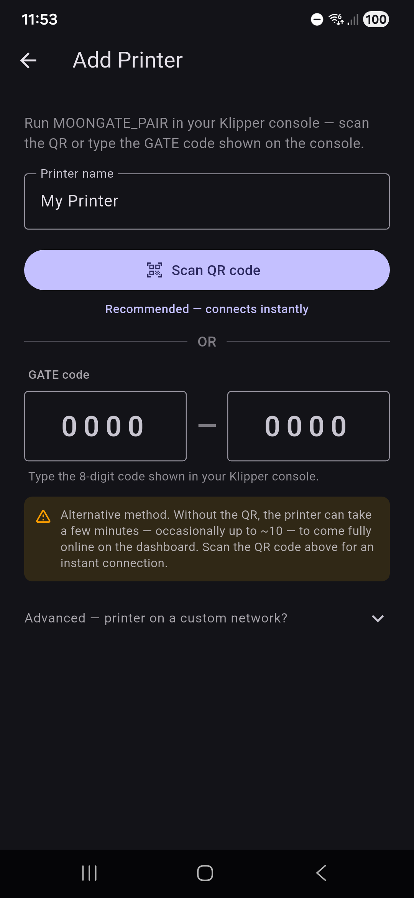

<div align="center">

# 🌙 Moongate

### One app. Your Klipper printer. Anywhere.

[](https://github.com/PEEKYPAUL/Moongate/releases/latest)
[](LICENSE)
[](#quick-start)
[](https://github.com/PEEKYPAUL/Moongate/releases/latest)

Moongate is a free, open-source Android app for **full remote control of your Klipper 3D printer** — live webcam, print controls, temperatures, and the complete Mainsail/Fluidd UI — over your home WiFi and automatically over the internet when you're away. No Tailscale, no VPN setup, no subscriptions.

<table>
  <tr>
    <td></td>
    <td></td>
    <td></td>
    <td></td>
  </tr>
</table>

</div>

---

## Contents

- [Features](#features)
- [Screenshots](#screenshots)
- [Quick start](#quick-start)
- [How it works](#how-it-works)
- [Updating &amp; removing »](docs/managing-moongate.md)
- [Documentation](#documentation)
- [Buy me a coffee](#buy-me-a-coffee)
- [License](#license)

---

## Features

| | |
|---|---|
| **Dashboard at a glance** | Live webcam thumbnails (pick the refresh rate — Raw / 1s / 3s / 5s — to balance smoothness against data use), print progress matched to Mainsail's slicer estimate, temperatures, chamber sensor, and a per-printer status badge. |
| **Print controls** | Pause, resume, and stop right from the tile (stop needs a confirm tap). Idle or errored printers get a one-tap firmware restart. |
| **Full Mainsail / Fluidd UI** | Tap a tile to open the complete web UI in-app — auto-detects whichever you run. |
| **Auto local / remote** | Tries home WiFi first on every poll; falls back to the Cloudflare tunnel within ~2s when you're away, and flips back to "Local" the moment you're home again. |
| **App lock** | Optional PIN + biometric (fingerprint/face) lock on launch, with configurable auto-lock and screenshot protection. Off by default. |
| **Hardened remote access** | Every internet-facing request is gated by a short-lived signed token. The tunnel URL alone gives an attacker nothing — just flat `401`s with no Mainsail/Moonraker fingerprint. |
| **Secure, simple pairing** | One Klipper command makes a time-limited QR + code — scan it for an instant connection. LAN-only: no port forwarding, static IP, or DNS to manage. Printer behind a reverse proxy or in Docker? Set its address by hand. |
| **Themes &amp; layout** | System / Light / Dark / fully **Custom** colours, a 1–3 column grid, font scaling, and optional landscape. |
| **Backup &amp; in-app updates** | Back up / restore your printer list to a file, and get a one-tap prompt when a new release lands. |

---

## Screenshots

<table>
  <tr>
    <th>Custom theme editor</th>
    <th>Colour picker</th>
    <th>Menu — top</th>
    <th>Menu — bottom</th>
  </tr>
  <tr>
    <td></td>
    <td></td>
    <td></td>
    <td></td>
  </tr>
</table>

---

## Quick start

Three steps: install the Pi plugin, install the app, pair.

### 1. Install the Pi plugin

SSH into your Pi and run:

```bash
curl -fsSL https://raw.githubusercontent.com/PEEKYPAUL/moongate/master/klipper-plugin/install.sh | bash
```

This installs the plugin, the `MOONGATE_PAIR` macro, the QR pairing page, the auth proxy, and the Cloudflare tunnel, then restarts Moonraker. Future updates appear in **Mainsail → Software Updates → Moongate**.

<details>
<summary><b>Requirements &amp; custom HTTP port</b></summary>

<br>

**Requirements:** a Raspberry Pi running Klipper + Moonraker + Mainsail or Fluidd (standard KIAUH / MainsailOS / FluiddPI). Tested on aarch64 (Pi 4/5) and armv7l (Pi 3).

**Non-standard port?** Moonraker usually serves on port 80 (the installer's default). If yours is elsewhere, tell the installer:

```bash
MOONGATE_PORT=8080 bash -c "$(curl -fsSL https://raw.githubusercontent.com/PEEKYPAUL/moongate/master/klipper-plugin/install.sh)"
```

In the app's pair screen, set the **Port** field to match (leave it blank for 80).

</details>

### 2. Install the app

[](https://github.com/PEEKYPAUL/Moongate/releases/latest)

Android only. Enable **Install from unknown sources** for your browser or file manager, then open the APK. Every release lives on the [Releases page](https://github.com/PEEKYPAUL/Moongate/releases).

### 3. Pair

1. Run **`MOONGATE_PAIR`** in the Klipper / Mainsail console.
2. On a device on the **same WiFi as your Pi**, open `http://<your-pi-ip>/moongate-pair.html` — a QR appears.
3. In the app, tap **+ → Scan QR** and point the camera at it. Done — your printer lands on the dashboard.

No working camera? Type the **`GATE-XXXX-XXXX`** code shown in the console instead.

> Pairing is LAN-only by design: nothing to port-forward, no URL to share. Already running Moongate and reinstalling or switching phones? Read **[Updating &amp; removing](docs/managing-moongate.md)** *before* you uninstall — a fresh install needs re-pairing.

---

## How it works

```
                        ┌──────────────────────┐
                        │   Cloud middleman    │   anonymous sign-in;
                        │   (identity & lookup)│   tells the app where
                        └──────────┬───────────┘   your printer is right now
                                   │ short-lived
                                   │ access token
                                   ▼
   ┌─────────────────┐                  ┌──────────────────────────────┐
   │  Moongate App   │◄──── LAN ───────►│  Raspberry Pi                │
   │   (Android)     │      (home)      │   • Klipper + Moonraker      │
   │                 │◄── Cloudflare ──►│   • Moongate plugin          │
   │                 │   tunnel (away)  │   • Auth proxy — gates every │
   └─────────────────┘                  │     internet-facing request  │
                                        └──────────────────────────────┘
```

1. **Your Raspberry Pi** runs Klipper, Moonraker, the Moongate plugin, and an auth proxy. The proxy sits in front of everything reachable from the internet — any request without a valid, short-lived token gets a flat `401 Unauthorized` with no fingerprint hinting at what's underneath.

2. **A small cloud middleman** handles anonymous sign-in (no email, no password) and tells the app where to find your printer right now — the Cloudflare tunnel URL rotates each Pi reboot, and the middleman tracks the current one. The app fetches a fresh signed token before each request.

3. **The Moongate app** tries home WiFi first (fast, no internet round-trip), then automatically falls back to the tunnel when you're away. Either path is gated by the same token, and both hit the same plugin on the same Pi.

**The headline:** leaking the tunnel URL alone gives an attacker nothing — every path through it returns `401` without revealing what's there. Full threat model in [SECURITY.md](SECURITY.md).

---

## Documentation

| Document | What's inside |
|---|---|
| [Updating &amp; removing](docs/managing-moongate.md) | Updating the app &amp; plugin, reinstalling / moving to a new phone, full uninstall |
| [DEVELOPMENT.md](DEVELOPMENT.md) | Building from source, repo layout, debugging, release signing, CI |
| [ARCHITECTURE.md](ARCHITECTURE.md) | Code structure, state management, data-flow walkthroughs, design decisions |
| [SECURITY.md](SECURITY.md) | Threat model, what the tunnel does and doesn't expose, the empirical 35-vector verification, vulnerability reporting |
| [TROUBLESHOOTING.md](TROUBLESHOOTING.md) | Common failure modes — offline tiles, tunnel issues, pairing failures — each with copy-paste diagnostics |
| [CHANGELOG.md](CHANGELOG.md) | Every release with a one-line summary of what changed and why |

> **Building from source?** `cd mobile && flutter pub get && flutter build apk --release`. Full developer workflow in [DEVELOPMENT.md](DEVELOPMENT.md).

---

## Buy me a coffee

Moongate is free, open source, and built in my spare time for the Klipper community — no ads, no subscriptions, no data harvesting. If it's earned a spot on your phone, you can buy me a coffee to say thanks. Every contribution goes straight back into the project: test hardware, the cloud service that keeps remote access working, and the time to keep shipping features like these.

Thank you for being part of it 💜

<p align="center">
  <a href="https://www.paypal.com/donate/?hosted_button_id=WCWAZKQ7WKQB4">
    
  </a>
</p>

---

## License

**PolyForm Noncommercial License 1.0.0** — see [LICENSE](LICENSE) for the full legal text.

**Plain English:**

- ✅ Read the source, build it yourself, run it on your own printers — free, no permission needed
- ✅ Modify it for your own use, share your fork for non-commercial purposes — free
- ✅ Use at a charity, school, public research org, public safety / health org, environmental org, or government institution — free regardless of funding source
- ❌ Selling Moongate, charging for access, including it in a paid product, or any other commercial use — **requires a separate written licence from me**

If you'd like to use Moongate commercially, [open a GitHub issue](https://github.com/PEEKYPAUL/Moongate/issues/new) or contact [@PEEKYPAUL](https://github.com/PEEKYPAUL) directly to discuss terms.

---

<div align="center">
<sub>Created by <a href="https://github.com/PEEKYPAUL">Paul Sharman</a></sub>
</div>
